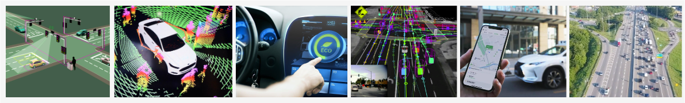

---
# Feel free to add content and custom Front Matter to this file.
# To modify the layout, see https://jekyllrb.com/docs/themes/#overriding-theme-defaults

permalink: /
title: Home
layout: all
---

Progress in autonomous vehicle (AV) technologies is indisputable, as evidenced by growing industrial and even commercial deployments. The time is ripe for the research community to reflect on the road ahead — including upcoming challenges and opportunities. Despite the real-world deployments, there remains no satisfactory answer to the questions of how safe is `safe enough,' how to assure safety at scale, the extent to which AV technology will provide societal value (e.g., congestion relief, emissions reduction, increased mobility access), nor to the role of digital and physical infrastructure in complementing AV technology. These questions require not only consideration of the ego vehicle, but also the traffic system and the transportation network as a whole.

While robotics research has focused on the ego vehicle challenges, such as advancing perception, localization, and planning, parallel lines of research in the control, operations research, and transportation communities examine questions beyond the ego vehicle, such as system-level control, operations, and broader implications of AV technologies. These emerging efforts revolve around the challenges, impact, and applications of AVs, spanning the traffic level (e.g., utilizing AVs as Lagrangian actuators for optimizing traffic flow), network level (e.g., integrating AVs as robo-taxis in dynamic mobility-on-demand systems), and even the regional level (e.g., shaping AV-related policymaking).

In this workshop, we encourage discussion and collaboration across the three ‘scales’ of AV research: (1) ego vehicle, (2) traffic, and (3) network. Up to this point, such scales have primarily been investigated by disparate research communities. But ultimately, they will affect people’s lives in the same transportation system. Hence, this workshop seeks to bring together these perspectives and researchers, with the aim of providing space for lively discussion and debate on how to best move forward for a holistic design of future AV-enabled mobility systems.

#### Discussion Topics

- **Ego-vehicle scale**: What fundamental technical challenges remain for autonomous driving? How safe is safe enough, and how can we know if we have achieved the appropriate level of safety? Potential sub-topics include planning, perception, localization, mapping, behavior prediction, human factors, and safety assurances for AVs.
- **Traffic scale**: What value can AVs provide to the traffic flow, beyond their immediate passengers? What is the role of infrastructure in complementing AV technology? What are the fundamental similarities and differences in leveraging vehicles for traffic control versus traditional means, such as traffic signal control, ramp metering, variable speed limit control, or congestion pricing? Potential sub-topics include optimizing AVs for system-level objectives(ex: traffic smoothing and eco-driving), mixed autonomy traffic, cooperative sensing or control, long-term traffic simulation and calibration, large-scale multi-agent traffic optimization, value of sensor information, and infrastructure readiness.
- **Network scale**: What are the implications of AV technology on travel demand, energy demand, mobility access, land use, and parking? What is the role of algorithmic research in supporting changes to policy and operations at the transportation network scale? Potential sub-topics include network optimization, transit integration, and land use optimization (e.g., parking) in light of AVs. 
- **Scale overlaps**: Potential sub-topics include co-design techniques that involve two or more scales of autonomous vehicle research.
- **Benchmarks**: What benchmark environments will help the community better measure the progress of autonomous vehicle research at different scales?

### Schedule

The workshop will be held in-person as a full day workshop on July 15 in <b>IDE Studio 23/24 at TU Delft, Netherlands</b>. ([Google Maps location](https://maps.app.goo.gl/4F6q9rbF9p7xvziF7))

All talk videos are available <a href="https://www.youtube.com/playlist?list=PLVJEb_y9MYLL9q14NDxTjQXOFMwb6uPGz"> here</a>. 

<table>
<thead>
  <tr>
    <th>Time (<a href="https://www.worldtimeserver.com/current_time_in_NL.aspx?city=Delft">CET</a>, GMT+1)</th>
    <th>Event</th>
  </tr>
</thead>
<tbody>
  <tr>
    <td>8.45 am - 9:00 am</td>
    <td>Introductory Remarks: Cathy Wu (MIT) 📹 <a href="https://youtu.be/ACvCRbwz91s?list=PLVJEb_y9MYLL9q14NDxTjQXOFMwb6uPGz"> Video </a> </td>
  </tr>
  <tr>
    <td>9:00 am - 9:40 am</td>
    <td>Invited Talk 1 (Scale 1): Marco Pavone (NVIDIA) 📹 <a href="https://youtu.be/OD5pWncmw-I?list=PLVJEb_y9MYLL9q14NDxTjQXOFMwb6uPGz"> Video </a>
    

      
Talk title and abstract

      

      
<strong>Title:</strong>Rethinking AV Development with AV Foundation Models

      
<strong>Abstract:</strong> Foundation models, trained on vast and diverse data encompassing the human experience, are at the heart of the ongoing AI revolution influencing the way we create, problem solve, and work. These models, and the lessons learned from their construction, can also be applied to the way we develop a similarly transformative technology, autonomous vehicles. In this talk, I will highlight recent research efforts towards rethinking elements of an AV program both in the vehicle and in the data center, with an emphasis on (1) composing ingredients for universal and controllable end-to-end simulation, (2) architecting autonomy stacks that leverage foundation models to generalize to long-tail events, and (3) ensuring safety with foundation models in the loop.

    

    </td>
  </tr>
  <tr>
    <td>9:40 am - 9:50 am</td>
    <td>Spotlight Talk 1 (Scale 1) 📹 <a href="https://youtu.be/6k5yUG8Lwr4?list=PLVJEb_y9MYLL9q14NDxTjQXOFMwb6uPGz"> Video </a> </td>
  </tr>
  <tr>
    <td>9:50 am - 10.00 am</td>
    <td>Spotlight Talk 2 (Scale 2) 📹 <a href="https://youtu.be/XHRGdMcmLAo?list=PLVJEb_y9MYLL9q14NDxTjQXOFMwb6uPGz"> Video </a> </td>
  </tr>
  <tr>
    <td>10:00 am - 10:30 am</td>
    <td>Coffee Break and Poster Session</td>
  </tr>
  <tr>
    <td>10:30 am - 11:10 am</td>
    <td>Invited Talk 2 (Scale 3): Samitha Samaranayake (Cornell University) 📹 <a href="https://youtu.be/IXXxKgM-tw4?list=PLVJEb_y9MYLL9q14NDxTjQXOFMwb6uPGz"> Video </a>
    

      
Talk title and abstract

      

      
<strong>Title:</strong>The need for a greater focus on mass-transit as we move towards an autonomous vehicle future

      
<strong>Abstract:</strong> Affordable, equitable and efficient access to personal mobility is a fundamental societal need---with broad implications for personal well-being, economic mobility, education, and public health. While shared mobility, autonomy and electrification are getting most of the attention in the research community and industry, we can not have urban transportation systems that are sustainable, equitable and scalable without a fundamental focus on mass-transit. This raises many interesting questions on when and how innovations in vehicle autonomy can be integrated with mass transit to improve personal mobility and related societal goals (e.g., sustainability and equity). This talk will focus on some algorithmic and practical questions related to designing and operating new multi-modal transit systems and the value of autonomy in this context. We will discuss the problem setting at a high-level and talk about some specific challenges/solutions for ride-pooling (a.k.a. microtransit, dial-ride) and bus line-planning in the multi-modal setting. We will also have some discussion on equity considerations if time permits. 

    

    </td>
  </tr>
  <tr>
    <td>11:10 am - 11:50 am</td>
    <td>Invited Talk 3 (Scale 2): Eugene Vinitsky (New York University) 📹 <a href="https://youtu.be/GvQbt2oXIgo?list=PLVJEb_y9MYLL9q14NDxTjQXOFMwb6uPGz"> Video </a></i> 
    

      
Talk title and abstract

      

      
<strong>Title:</strong>Progress and bottlenecks in deploying mixed autonomy traffic optimization at scale

      
<strong>Abstract:</strong> The increasing penetration rate of level-2 autonomous vehicles with autonomous distance and lane-keep represents an opportunity to begin testing and implementing automated schemes for improving congestion and energy efficiency. We report on the algorithms and outcome of the CIRCLES project, which deployed 100 reinforcement-learning-controlled vehicles aiming to diminish the energy impact of stop-and-go waves. Finally, we discuss lessons learned from the test that represent serious bottlenecks limiting the scaling and efficacy of mixed autonomy traffic smoothing and some prospective research approaches to resolving them.

    

    </td>
  </tr>
  <tr>
    <td>11:50 am - 12:30 pm</td>
    <td>Invited Talk 4 (Scale 1): John Subosits (Toyota Research Institute) 📹 <a href="https://youtu.be/oc1ICpIl2GU?list=PLVJEb_y9MYLL9q14NDxTjQXOFMwb6uPGz"> Video </a>
    

      
Talk title and abstract

      

      
<strong>Title:</strong>Uncertainty-Aware Modeling and Control for Driving at the Limits of Handling

      
<strong>Abstract:</strong> Human drivers skilled in motorsports disciplines such as circuit racing, drifting, and rally, display an incredible ability to control their vehicle up to the limits of its capability, even in uncertain, changing conditions.  Inspired by the possibility of using these capabilities for collision avoidance, autonomous vehicle research has yielded a  number of impressive demonstrations of autonomous racing and drifting. However, these systems still do not match the performance of the best human drivers, particularly in terms of robustness to uncertainty.  This talk will argue for uncertainty-aware control as a means to help autonomous vehicles behave appropriately cautiously in critical situations and will present our ongoing work in modeling uncertain system dynamics and in using these models for planning and control. 

    

    </td>
  </tr>
  <tr>
    <td>12:30 pm - 2:00 pm</td>
    <td>Lunch Break</td>
  </tr>
  <tr>
    <td>2:00 pm - 2:10 pm</td>
    <td>Spotlight Talk 3 (Scale 3)  📹 <a href="https://youtu.be/Kg7tgK5UOPQ?list=PLVJEb_y9MYLL9q14NDxTjQXOFMwb6uPGz"> Video </a> </td>
  </tr>
  <tr>
    <td>2:10 pm - 2:50 pm</td>
    <td>Invited Talk 5 (Scale 3): Alan Rao (U.S. DOT Volpe National Transportation Systems Center) 📹 <a href="https://youtu.be/QxchU2KCNkY?list=PLVJEb_y9MYLL9q14NDxTjQXOFMwb6uPGz"> Video </a>
    

      
Talk title and abstract

      

      
<strong>Title:</strong>TBA

      
<strong>Abstract:</strong> TBA 

    

    </td>
  </tr>
  <tr>
    <td>2:50 pm - 3:30 pm</td>
    <td>Invited Talk 6 (Scale 2): Negar Mehr (UC Berkeley) 📹 <a href="https://youtu.be/02i2hem65uI?list=PLVJEb_y9MYLL9q14NDxTjQXOFMwb6uPGz"> Video </a>
    

      
Talk title and abstract

      

      
<strong>Title:</strong>Socially-Aware Control of Mixed-Autonomy Traffic Networks in the Face of Evolving Human Behavior

      
<strong>Abstract:</strong> As autonomous cars become tangible technologies, they need to be integrated into environments shared by humans. A key challenge in this integration is that humans are not programmable devices that can simply be endowed with objectives to optimize. Humans are strategic decision-makers who adapt and evolve. Consequently, the interaction between humans and autonomous cars may have complex and even undesirable impacts on society. Therefore, when designing control strategies for future mobility systems, we must account for the social implications of the interaction between humans and autonomous systems. In this talk, I will address the socially-aware control of mixed-autonomy traffic networks, where roads are shared by human-driven and autonomous cars. I will explore the system-level mobility implications of these mixed-autonomy networks, focusing on travelers' routing decisions as a key factor affecting overall mobility. I will discuss control algorithms that promote efficient routing decisions by travelers in mixed-autonomy networks. I will cover the research challenges associated with the socially-aware control of the core components of a mixed-autonomy network: autonomous cars, humans, and the transportation infrastructure. 

    

    </td>
  </tr>
  <tr>
    <td>3:30 pm - 4:00 pm</td>
    <td>Coffee Break and Poster Session</td>
  </tr>
  <tr>
    <td>4:00 pm - 4:50 pm</td>
    <td>Panel Discussion: Samitha Samaranayake, John Subosits, Eugene Vinitsky</td> 
  </tr>
  <tr>
    <td>4:45 pm - 5:00 pm</td>
    <td>Best Paper Award & Conclusion Remarks</td>
  </tr>
  <tr>
    <td>7:30 pm - 10:30 pm</td>
    <td>AVAS Reception hosted by <a href="https://www.getcruise.com/">Cruise</a> at <a href="https://westcordhotelsnl.pixieset.com/hotelarsenaal/">Hotel Arsenaal</a></td>
  </tr>
</tbody>
</table>
